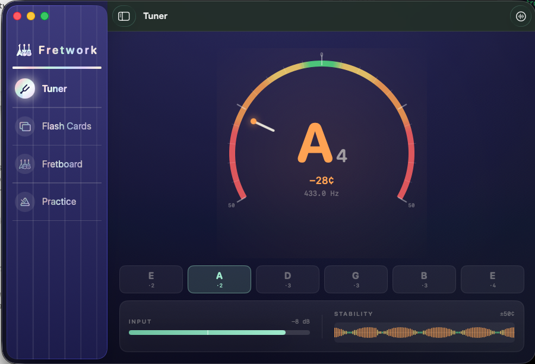
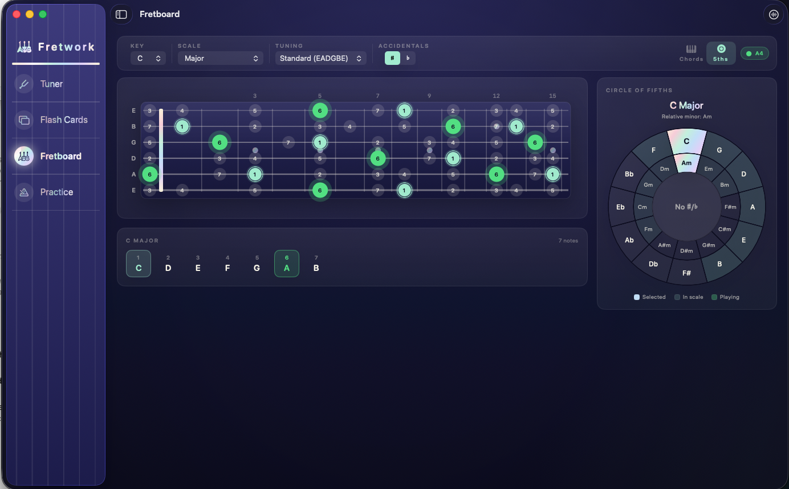
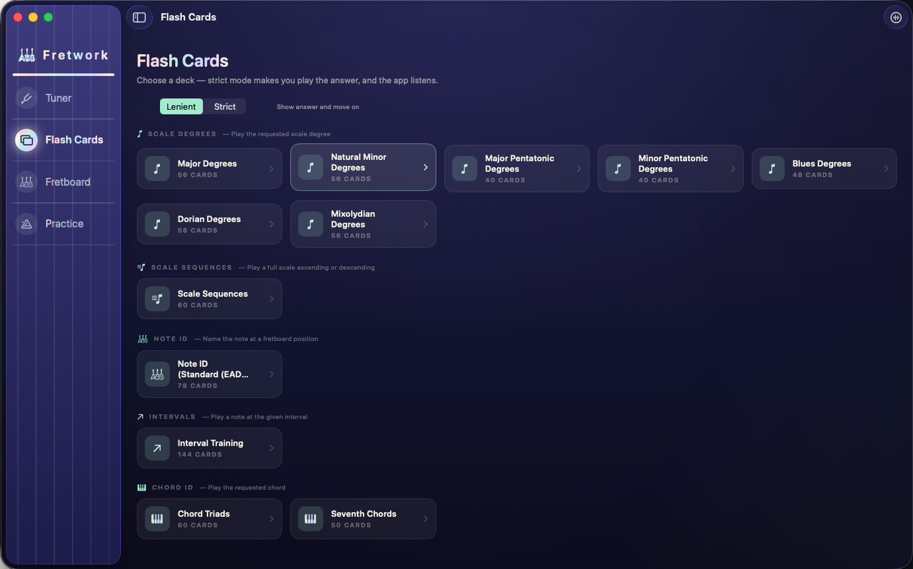
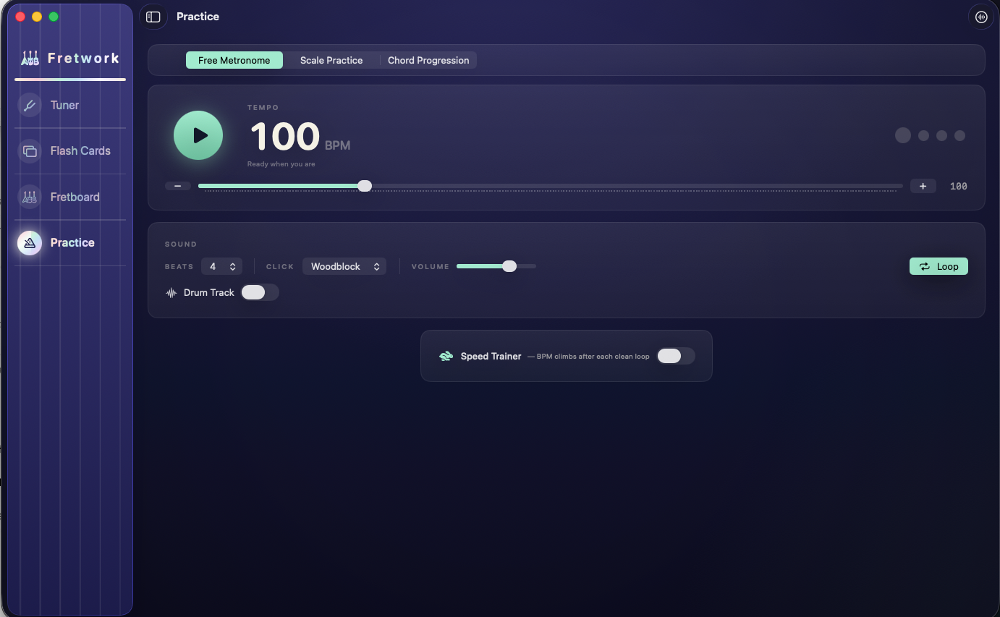

# Fretwork

[](https://github.com/ikidd42/Fretwork/actions/workflows/ci.yml)

A native macOS guitar practice app that listens: real-time tuner, live chord
detection, an interactive fretboard, flash-card drills you answer by
*playing*, and a metronome with synthesized drums. SwiftUI on a hand-rolled
Core Audio engine — **zero package dependencies**.



## Features

- **Tuner** — sub-5-cent accuracy from a YIN pitch detector fed directly by
  a Core Audio HAL IOProc at ~2.7 ms latency. A 240° halo gauge carries the
  tuning zones, per-string chips track each open string, and the input
  meter marks the amplitude gate so you can watch a quiet pluck die before
  the tuner stops hearing it.
- **Chord detection** — FFT chromagram matched against templates for 144
  chords, hardened against real-guitar physics: odd-harmonic sieving,
  energy-adaptive smoothing, and Schmitt-trigger thresholds.
- **Fretboard** — every note of any key/scale across 22 frets and five
  tunings, live highlighting of what you're playing, detected chords
  overlaid, and a circle-of-fifths companion.
- **Flash cards** — scale degrees, note ID, intervals, chord qualities;
  strict mode requires you to play the answer, and the app hears whether
  you did.
- **Practice** — guided scale runs and chord changes against a metronome
  with a speed trainer and synthesized kick/snare/hat patterns.

| Fretboard | Flash Cards | Practice |
|---|---|---|
|  |  |  |

## Architecture

```
MusicTheory (pure data: Note, Scale, Chord, Tuning, Fretboard)
    ↑
Audio (engine: PitchAnalyzer, ChordAnalyzer, LivePitchDetector, AudioMetronome)
    ↑
Features (MVVM: @Observable ViewModels + SwiftUI views per tab)
```

Three decisions carry most of the interesting weight:

**HAL IOProc instead of `installTap`.** `AVAudioEngine.installTap` batches
USB-interface audio into ~100 ms bursts, which is unusable for a tuner.
Registering an `AudioDeviceIOProc` on the input device directly delivers
every hardware buffer (128 frames ≈ 2.7 ms at 48 kHz) — the same approach
DAWs use. Monitoring playback is a separate `AVAudioEngine` whose player
node is fed from the IOProc callback.

**YIN, implemented from the paper.** Pitch detection follows de Cheveigné &
Kawahara, *YIN, a fundamental frequency estimator for speech and music*
(JASA 2002): cumulative-mean-normalized difference function, absolute
threshold, parabolic interpolation for sub-sample period accuracy. The
implementation is ~150 lines of vDSP in
[`PitchAnalyzer.swift`](Fretwork/Audio/PitchAnalyzer.swift).

**Chromagram chord matching hardened on a real guitar.** The chord detector
FFTs a 4096-sample window, picks spectral peaks (parabolic interpolation
recovers true frequencies from 11.7 Hz-wide bins — coarser than a semitone
in the low range), suppresses peaks sitting at 3×/5×/7× a lower peak (odd
harmonics inject phantom pitch classes — the fifth's 5th harmonic *is* the
root's major seventh), folds the survivors into a 12-bin pitch-class
profile, and cosine-matches against chord templates with acquire/hold
hysteresis on both confidence and signal level. Every clause exists
because a test — or a live strum — failed without it.

**Concurrency model.** ViewModels are `@MainActor @Observable`; audio
classes are `nonisolated` with NSLock-guarded state, snapshot-per-callback
on the IO thread, and locks never held across blocking Core Audio calls.
The project builds warning-free under Swift's default-MainActor isolation.

## The DSP is tested — and the tests found the bugs

The test suite synthesizes audio (pure sines, harmonic-rich decaying
plucks, strummed chords with string inharmonicity and detune — including
barre voicings with uneven string levels) and feeds it through the
analyzers in 128-frame chunks, exactly as the HAL delivers it. Real field
bugs were diagnosed this way:

1. **"The tuner doesn't hear my D string."** Tests proved YIN was accurate
   at every string frequency and that RMS doesn't depend on frequency — so
   the fault had to be the amplitude gate: a hardcoded threshold duplicated
   across four ViewModels, more than double the value the chord detector
   used for the same signal.
   ([`PitchAnalyzerTests.swift`](FretworkTests/PitchAnalyzerTests.swift))

2. **"Em keeps flickering to Bsus4."** Synthesized strums reproduced it:
   Em's open voicing has three E strings and two B strings but only one G,
   and the B strings' harmonics inject phantom notes — when the G string's
   energy dipped below the noise gate, {E, B, F#} is literally Bsus4.
   ([`ChordAnalyzerTests.swift`](FretworkTests/ChordAnalyzerTests.swift))

3. **Live play-testing closed the loop.** A transition-only chord log
   (`log stream` on subsystem `com.fretwork.app`) captured five sessions of
   real strums; each hardening change in the analyzer traces to a
   timestamped failure in those logs, and one experiment that regressed
   barre chords was caught and reverted the same way.

Run them:

```sh
xcodebuild test -project Fretwork.xcodeproj -scheme Fretwork -destination 'platform=macOS'
```

## Building

- macOS 14.6+, Xcode 26+
- `open Fretwork.xcodeproj`, hit Run. No packages to resolve.
- The app asks for microphone access on first launch of any listening tab.
- Launch with `--demo` to swap the hardware detectors for scripted mocks —
  the UI comes alive without a guitar or mic permission (it's how the
  screenshots above were made).

## How it was built

Fretwork is a solo project built by directing AI coding tools through a
real engineering process: a standing code-review document, session-to-
session handoff notes, test-driven bug hunts (write the failing test that
reproduces the symptom, then fix), and hardware verification on a real
guitar as the final gate for anything the tests can't hear. The DSP
debugging and design-system foundations were built with Claude Code; the
"Night Stage" UI treatment was a pass by Kimi K3, cross-reviewed in-app
before merging. The commit history reads as a log of that process.

## Known limitations

- The microphone stays hot from the first listening tab until quit (single
  shared detector by design; stopping on window close is planned).
- The metronome schedules clicks from a dedicated thread; sample-accurate
  `scheduleBuffer(at:)` scheduling would remove residual jitter.
- Flash-card hint fretboards always render standard tuning.
- App Sandbox is currently disabled; enabling it with the audio-input
  entitlement is on the roadmap.

## License

[MIT](LICENSE)
